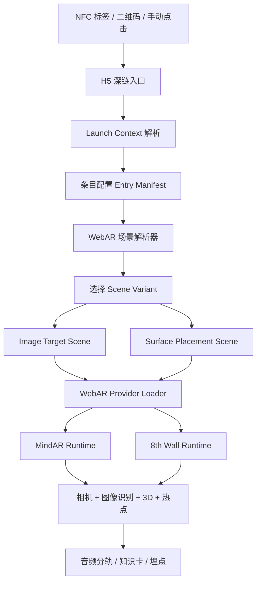
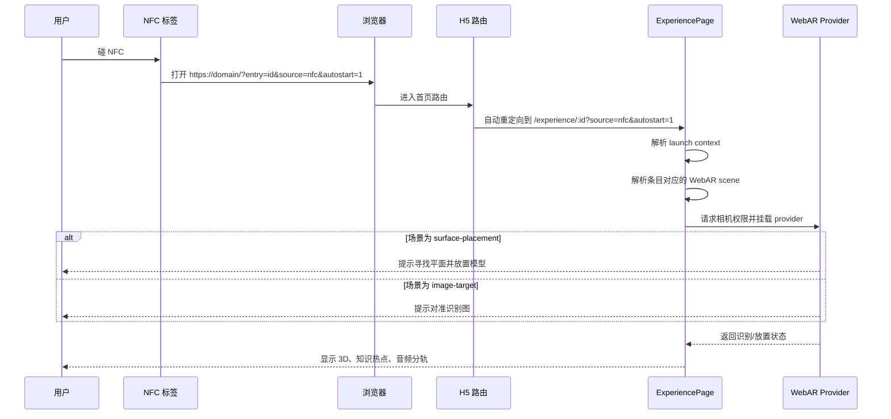
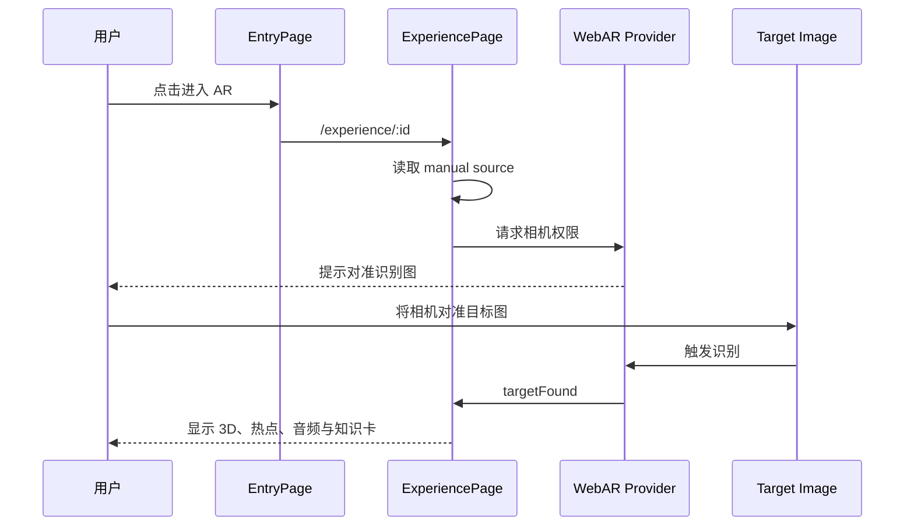

# WebAR 统一技术方案与页面事件流

本文对应当前仓库的跨端 WebAR 改造方向，目标是同时覆盖：

- Android + iOS
- 浏览器内直接开相机
- 图像触发 AR
- NFC / 二维码作为入口触发
- 后续可接入 8th Wall 这类 WebAR 引擎，而不推翻当前 React 代码

## 1. 统一技术方案图



### 分层说明

- `Launch Context`
  负责识别当前请求来自 `manual / qr / nfc`，并决定是否自动进入体验页。
- `Entry Manifest`
  负责存储条目内容与场景配置，不直接绑死某个引擎。
- `WebAR 场景解析器`
  负责把旧的 `MindAR` 字段或新的 `webar.scenes` 统一解析成可运行的场景。
- `Provider Loader`
  负责真正挂载某个 WebAR SDK。当前仓库已保留 `MindAR` 路径，并为 `8th Wall` 预留 provider 位。

## 2. 场景策略

### 推荐跨端策略

- `图像触发`
  统一用 `image-target` 场景。
- `NFC / 二维码入口`
  入口负责“选中条目 + 打开页面”。
- `NFC` 默认场景
  生产方案建议指向 `surface-placement`，让用户直接在真实空间里放置模型。
- `二维码` 默认场景
  建议仍走 `image-target` 或按运营场景自行切到 `surface-placement`。

### 当前仓库状态

- 已实现
  `MindAR image-target`
- 已预留但未接入运行时
  `8th Wall image-target / surface-placement`

## 3. 页面事件流

### 3.1 NFC 入口事件流



### 3.2 图像触发事件流



## 4. 当前代码怎么改

### 已完成的结构改造

- `src/lib/launch.ts`
  新增入口上下文解析，统一处理 `source` 和 `autostart`。
- `src/lib/webar.ts`
  新增 WebAR 场景解析层，把旧字段和新配置统一成 `ResolvedWebArScene`。
- `src/components/ar/WebArScene.tsx`
  新增 provider 入口层，由它决定走 `MindAR` 还是其他 provider。
- `src/components/ar/MindArScene.tsx`
  从直接读取 `entry.targetImage / trackingTargetSrc` 改为读取解析后的场景配置。
- `src/components/ar/WebArPlaceholderScene.tsx`
  对未接入的 provider 或不支持的 tracking mode 明确报错，而不是静默失败。
- `src/pages/HomePage.tsx`
  带 `autostart=1` 的深链现在会直接跳到体验页。
- `src/pages/EntryPage.tsx`
  区分了 `NFC` 链接与 `二维码` 链接。
- `src/pages/ExperiencePage.tsx`
  页面状态改为基于 `launch context + resolved scene` 驱动。
- `scripts/generate-links.mjs`
  现在会分别导出 `nfcUrl` 和 `qrUrl`。

### 你后续接 8th Wall 时要改的点

1. 在 `src/components/ar/` 新增 `EightWallScene.tsx`
   负责加载 8th Wall SDK、挂载 image-target 或 surface-placement 场景。
2. 在 `src/components/ar/WebArScene.tsx`
   增加 `scene.provider === '8thwall'` 的分支。
3. 在 `src/lib/webar.ts`
   保持现有解析逻辑不变，只补 `8th Wall` 运行时需要的额外字段。
4. 在 `.env`
   增加类似 `VITE_8THWALL_APP_KEY` 的配置。
5. 在条目配置中补 `webar.scenes`
   把 `nfc` 默认场景切到 `surface-placement`。

## 5. 推荐的条目配置写法

当前仓库仍兼容旧字段。正式接入 WebAR 引擎后，建议把条目逐步迁移成下面这种结构：

```json
{
  "id": "violin-dialogue",
  "sceneType": "webar",
  "targetImage": "/assets/markers/violin-dialogue.png",
  "trackingTargetSrc": "/assets/markers/violin-dialogue.mind",
  "modelUrl": "/assets/models/violin-dialogue/scene.glb",
  "webar": {
    "provider": "8thwall",
    "defaultSceneId": "image",
    "sourceSceneMap": {
      "manual": "image",
      "qr": "image",
      "nfc": "placement"
    },
    "scenes": [
      {
        "id": "image",
        "trackingMode": "image-target",
        "target": {
          "previewImage": "/assets/markers/violin-dialogue.png",
          "trackingTargetSrc": "/assets/markers/violin-dialogue.mind",
          "targetIndex": 0
        }
      },
      {
        "id": "placement",
        "trackingMode": "surface-placement",
        "placementPrompt": "请将镜头对准地面或桌面，然后点击放置小提琴模型。"
      }
    ]
  }
}
```

## 6. 当前仓库的建议接入顺序

1. 先保持 `MindAR image-target` 跑通现有 demo。
2. 再接入 `8th Wall image-target`，替换图像识别 runtime。
3. 最后补 `surface-placement` 场景，让 `NFC` 默认进入空间放置模式。

## 7. 一句话结论

当前项目已经不再把页面逻辑绑死在 `MindAR` 上，入口来源、场景模式和 provider 都已经抽开。后续你要做的核心工作，不是重写 React 页面，而是把 `8th Wall` 这类 WebAR 引擎接到新的 provider 层上。
